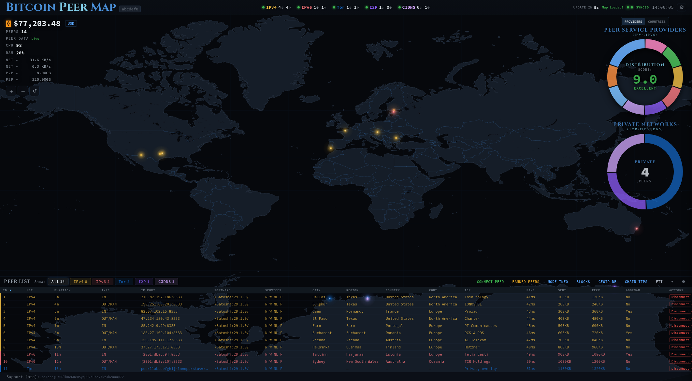

# Bitcoin Peer Map

A dashboard for monitoring and managing peers connected to a **Bitcoin Knots**
node. Explore your peers on a world map, compare networks and
service providers, and inspect node, block, and mempool information.

> **Node support:** This project focuses on Bitcoin Knots. Bitcoin Core is no
> longer supported.



- Map connected peers by location, network, and service provider.
- Inspect peer details, connection status, traffic, and advertised services.
- Search the peer list, remove individual filters, and export matching peers.
- Connect, disconnect, and ban peers from the dashboard.
- Cache peer locations locally and control external GeoIP lookups.

Search beside **Connect Peer** matches every word, ignoring case, across peer
IDs, addresses, software, location, providers, networks, and connection direction.
It combines with the current filters and stays in place as peer data refreshes.
Remove a filter chip to broaden that scope; removing **Private view** returns to
the public world with All networks. **Clear filters** clears the search and every
scope, including selections hidden by the private view.

**Export** downloads every matching peer in the current sort order, including
rows outside the visible table. CSV uses the visible columns and their display
values; JSON includes complete peer records, counts, filters, sort, columns, and
the export time. An empty result exports a CSV header or an empty JSON peer list.

## Requirements

- Docker Engine with Docker Compose.
- A Bitcoin Knots node with a reachable JSON-RPC endpoint.
- Dedicated RPC credentials for the dashboard.

The node can run on another machine or in another Compose project. Published
images support Linux AMD64 and ARM64.

## Quick start

### 1. Get the deployment files

Clone the repository and copy the example configuration:

```bash
git clone https://github.com/spyhunter493/bitcoin-peer-map.git
cd bitcoin-peer-map
cp .env.example .env
```

Compose uses the published image from
[GitHub Container Registry](https://github.com/spyhunter493/Bitcoin-Peer-Map/pkgs/container/bitcoin-peer-map).

### 2. Connect your Bitcoin Knots node

Edit `.env` with your node's RPC address and credentials:

```env
BITCOIN_RPC_HOST=192.168.1.10
BITCOIN_RPC_USER=bpm
BITCOIN_RPC_PASSWORD=replace-with-a-long-random-password
```

Your node must allow RPC connections from the dashboard. See the
[RPC setup guide](docs/configuration.md#bitcoin-rpc) if RPC is not configured yet.
For a node in another Compose project, see
[shared Docker networks](docs/configuration.md#another-compose-project).

Viewing is available without a login. To enable peer management and GeoIP setting
changes, set `BPM_ADMIN_TOKEN` in `.env` to your chosen token. There is no minimum
length. You will be prompted for it when managing the dashboard.
Use HTTPS outside a trusted network; see [admin authentication](docs/configuration.md#admin-token-and-read-only-mode).

### 3. Start the dashboard

```bash
docker compose up -d
```

Open **`http://HOST_IP:58333`**, replacing `HOST_IP` with the address of the machine
running Docker. Set `BPM_HOST_PORT` in `.env` to use a different port.

To stop the dashboard:

```bash
docker compose down
```

## Updating

The header shows the installed release version. An update arrow links to the
release notes when a newer stable GitHub Release is available; the server checks
once every 24 hours. Unreleased commits on `main` do not trigger notices.
Development builds show `dev` and skip release checks.

Pull the latest image and recreate the service:

```bash
docker compose pull bpm
docker compose up -d bpm
```

Keep the existing `bitcoin-peer-map-data` volume when upgrading. It stores peer
locations and server preferences. See [operations](docs/operations.md) for data
storage, image pinning, and troubleshooting commands.

Production images are published only by intentional GitHub Releases. Merging a
PR into `main` integrates changes without publishing. Each release provides
`:vMAJOR.MINOR.PATCH`, `:latest`, and `:sha-<full-commit>` image tags; see the
[maintainer release process](docs/development.md#release-flow).

## Documentation

| Guide | What it covers |
| --- | --- |
| [Configuration](docs/configuration.md) | Bitcoin Knots RPC, environment variables, shared networks, and Compose secrets |
| [Operations](docs/operations.md) | Updates, logs, health checks, saved data, GeoIP privacy, and dashboard controls |
| [Development](docs/development.md) | Local source builds, tests, architecture, API behavior, and image publishing |

## License

[MIT](LICENSE). Inspired by [mbhillrn](https://github.com/mbhillrn) and
[Mirobit](https://github.com/Mirobit).
